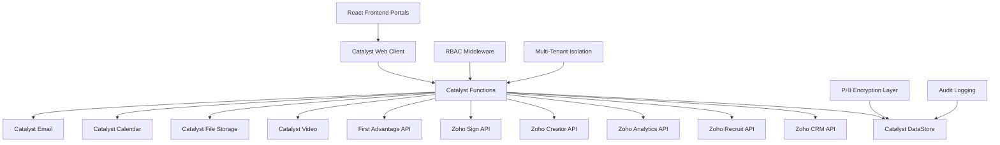

Based on your excellent Notion planning and the Zoho Catalyst documentation, here's what your [README.md](http://readme.md/) should say to properly reflect your multi-portal healthcare platform architecture:

## **�� [README.md](http://readme.md/) - Snug & Kisses Healthcare Platform**

```markdown
# 🏥 **Snug & Kisses Healthcare Platform**
**Complete B2B Employer Partnership Platform for Doula & Childcare Services**

[](<https://catalyst.zoho.com/>)
[](<https://nodejs.org/>)
[](<https://www.typescriptlang.org/>)
[](<https://reactjs.org/>)
[](<https://www.hhs.gov/hipaa/index.html>)

---

## 📋 **Table of Contents**

- [🎯 Project Overview](#-project-overview)
- [🏗️ Multi-Portal Architecture](#️-multi-portal-architecture)
- [🚀 Features](#-features)
- [🔧 Technology Stack](#-technology-stack)
- [📦 Installation & Setup](#-installation--setup)
- [🏥 Portal Access & User Roles](#-portal-access--user-roles)
- [🔐 Security & Compliance](#-security--compliance)
- [�� Development Phases](#-development-phases)
- [�� Testing](#-testing)
- [📚 API Documentation](#-api-documentation)
- [🚀 Deployment](#-deployment)
- [🤝 Contributing](#-contributing)
- [�� License](#-license)

---

## �� **Project Overview**

### **What is Snug & Kisses?**
Snug & Kisses is a comprehensive B2B healthcare platform that provides doula and childcare services through employer partnerships. The platform enables companies to offer family care benefits to their employees, creating a three-way relationship between the platform, employers, and employee-families.

### **Business Model**
```yaml
Platform ↔ Employer ↔ Employee-Family
- Platform: Service infrastructure and contractor network
- Employers: Purchase benefit packages and manage employee access
- Employees: Access services through employer portal
- Contractors: Deliver services to employee families

```

### **Core Services**

- **Postpartum Doula Support** - Specialized postpartum care and support
- **Birth Doula Support** - Birth preparation and labor support
- **Backup Childcare/Sitter Services** - Emergency and scheduled childcare

---

## 🏗️ **Multi-Portal Architecture**

### **System Overview**

The platform is built on **Zoho Catalyst** using a modern serverless architecture with **four distinct portals**, each serving specific user types and business functions:



### **Portal Architecture**

```
🏥 Snug & Kisses Healthcare Platform
├── �� Employee Portal (B2C via employer benefits)
│   ├── Service request management
│   ├── Hour balance tracking
│   ├── Service history
│   └── Emergency contact management
│
├── 👷 Contractor Portal (Self-service management)
│   ├── Multi-role application
│   ├── Document management
│   ├── Availability calendar
│   └── Service assignments
│
├── ⚙️ Admin Portal (System administration)
│   ├── Contractor onboarding
│   ├── Service coordination
│   ├── Compliance monitoring
│   └── System administration
│
└── 🏢 Employer Portal (HR/Benefits management)
    ├── Employee usage reports
    ├── Hour allocation management
    ├── Service area configuration
    └── Billing management

```

### **Multi-Tenant Architecture**

- **Employer-specific data isolation**
- **Company-specific branding and customization**
- **Employee data segregation by employer**
- **Contractor cross-employer access management**

---

## 🚀 **Features**

### **Core Platform Features**

- ✅ **Multi-Portal System** - Four distinct portals for different user types
- ✅ **Multi-Tenant Architecture** - Employer-specific access and customization
- ✅ **Role-Based Access Control** - Secure user management and permissions
- ✅ **Real-Time Availability Management** - Contractor scheduling and coordination
- ✅ **Automated Service Matching** - AI-powered contractor-client pairing
- ✅ **Time Tracking & Hour Management** - Real-time balance updates
- ✅ **Document Management System** - Secure storage with encryption
- ✅ **Video Integration** - Interviews, orientation, and training
- ✅ **Background Check Integration** - First Advantage API integration
- ✅ **E-Signature System** - Digital contract and agreement execution

### **Portal-Specific Features**

### **�� Employee Portal**

- Service request management
- Hour balance tracking
- Service history
- Emergency contact management
- Feedback & rating system

### **👷 Contractor Portal**

- Multi-role application (Doula, Sitter)
- Document upload and management
- Availability calendar management
- Service assignment tracking
- Time tracking (Sitters only)

### **⚙️ Admin Portal**

- System administration
- Contractor onboarding pipeline
- Service coordination
- Compliance monitoring
- Reporting & analytics

### **�� Employer Portal**

- Employee usage reports
- Hour allocation management
- Service area configuration
- Billing & payment management
- Contractor network access

---

## �� **Technology Stack**

### **Backend Platform**

- **Zoho Catalyst** - Serverless cloud platform
- **Node.js** - Runtime environment
- **TypeScript** - Type-safe development
- **Express.js** - Web application framework

### **Frontend (Multi-Portal)**

- **React.js** - User interface library for all portals
- **TypeScript** - Type-safe development
- **Tailwind CSS** - Utility-first CSS framework
- **React Router** - Client-side routing per portal

### **Database & Storage**

- **Catalyst DataStore** - NoSQL database
- **Catalyst File Storage** - Document and media storage
- **Redis** - Caching and session management

### **Authentication & Security**

- **Catalyst Authentication** - Built-in user management
- **JWT Tokens** - Secure session management
- **AES-256 Encryption** - PHI data protection
- **Role-Based Access Control** - Permission management per portal

### **Integrations**

- **Zoho CRM** - Client relationship management
- **Zoho Recruit** - Contractor recruitment
- **Zoho Analytics** - Business intelligence
- **Zoho Creator** - Workflow automation
- **Zoho Sign** - Digital signatures
- **First Advantage** - Background checks
- **Catalyst Video** - Video conferencing
- **Catalyst Email** - Automated communications

---

## 📦 **Installation & Setup**

### **Prerequisites**

```bash
# Required software
- Node.js 18+
- npm or yarn
- Git
- Zoho Catalyst account
- Zoho One subscription

```

### **Project Setup**

### **1. Clone the Repository**

```bash
git clone <https://github.com/Charitablebusinessronin/Snugnotwsl.git>
cd Snugnotwsl

```

### **2. Install Dependencies**

```bash
# Install backend dependencies
npm install

# Install frontend dependencies for each portal
cd portals/employee && npm install && cd ../..
cd portals/contractor && npm install && cd ../..
cd portals/admin && npm install && cd ../..
cd portals/employer && npm install && cd ../..

# Install shared component library
cd shared && npm install && cd ..

```

### **3. Environment Configuration**

```bash
# Copy environment template
cp .env.example .env

# Configure environment variables
ZOHO_CATALYST_PROJECT_ID=your_project_id
ZOHO_CATALYST_CLIENT_ID=your_client_id
ZOHO_CATALYST_CLIENT_SECRET=your_client_secret
ZOHO_CRM_AUTH_TOKEN=your_crm_token
ZOHO_RECRUIT_AUTH_TOKEN=your_recruit_token
FIRST_ADVANTAGE_API_KEY=your_api_key
FIRST_ADVANTAGE_CLIENT_ID=your_client_id

```

### **4. Catalyst Project Initialization**

```bash
# Install Catalyst CLI
npm install -g @zoho/catalyst-cli

# Login to Catalyst
catalyst login

# Initialize project
catalyst init

# Deploy to Catalyst
catalyst deploy

```

### **5. Database Setup**

```bash
# Run database migrations
npm run db:migrate

# Seed initial data
npm run db:seed

```

### **Development Server**

```bash
# Start backend development server
npm run dev

# Start frontend development servers for each portal
cd portals/employee && npm start &  # Runs on localhost:3000
cd ../contractor && npm start &     # Runs on localhost:3001
cd ../admin && npm start &          # Runs on localhost:3002
cd ../employer && npm start &       # Runs on localhost:3003

```

---

## 🏥 **Portal Access & User Roles**

### **Portal Access Matrix**

| User Type | Employee Portal | Contractor Portal | Admin Portal | Employer Portal |
| --- | --- | --- | --- | --- |
| **Employee** | ✅ Full Access | ❌ No Access | ❌ No Access | ❌ No Access |
| **Contractor** | ❌ No Access | ✅ Full Access | ❌ No Access | ❌ No Access |
| **Admin** | ✅ Read Access | ✅ Read Access | ✅ Full Access | ✅ Read Access |
| **Employer** | ❌ No Access | ❌ No Access | ❌ No Access | ✅ Full Access |

### **Role-Based Permissions**

- **Employees**: Personal services, hour tracking, service history
- **Contractors**: Self-management, availability, assignments
- **Admins**: System-wide control, contractor management
- **Employers**: Company-specific data, employee management

---

## 🔐 **Security & Compliance**

### **HIPAA Compliance**

- **PHI Encryption**: AES-256 encryption for all sensitive data
- **Audit Logging**: Comprehensive tracking with 6-year retention
- **Access Controls**: Role-based permissions and minimum necessary access
- **Data Isolation**: Multi-tenant architecture with strict boundaries
- **Incident Response**: Automated monitoring and alerting systems

### **Security Features**

- **Multi-Factor Authentication** - Enhanced login security
- **Session Management** - Secure token-based sessions
- **Data Encryption** - At rest and in transit
- **API Security** - Rate limiting and authentication
- **Vulnerability Scanning** - Regular security assessments

### **Compliance Monitoring**

- **Automated Auditing** - Real-time compliance checking
- **Policy Enforcement** - Automated rule enforcement
- **Incident Detection** - Proactive security monitoring
- **Reporting** - Compliance status and audit reports

---

## 📊 **Development Phases**

### **Phase 1: Foundation & Core Services (Weeks 1-4)**

- ✅ Multi-tenant architecture setup
- ✅ Core data models and encryption
- ✅ Authentication and authorization
- ✅ Basic portal structure

### **Phase 2: Multi-Portal Architecture (Weeks 5-8)**

- 🔄 Portal-specific interfaces
- 🔄 Role-based access control
- 🔄 Multi-tenant customization
- 🔄 User experience optimization

### **Phase 3: Core Business Workflows (Weeks 9-12)**

- ⏳ Contractor onboarding automation
- ⏳ Service matching algorithms
- ⏳ Time tracking system
- ⏳ Document management

### **Phase 4: Zoho Ecosystem Integration (Weeks 13-16)**

- ⏳ CRM and Recruit integration
- ⏳ Analytics and Creator apps
- ⏳ Real-time synchronization
- ⏳ Workflow automation

### **Phase 5: Advanced Features & Production (Weeks 17-20)**

- ⏳ Background check integration
- ⏳ E-signature system
- ⏳ Performance optimization
- ⏳ Production deployment

---

## 🧪 **Testing**

### **Testing Strategy**

```yaml
Unit Testing:
- Jest framework for backend testing
- React Testing Library for frontend
- 90%+ code coverage requirement
- Automated testing in CI/CD pipeline

Integration Testing:
- API endpoint testing
- Database integration testing
- Third-party service testing
- End-to-end workflow testing

Security Testing:
- Penetration testing
- Vulnerability scanning
- Compliance validation
- Access control testing

Performance Testing:
- Load testing with realistic scenarios
- Response time optimization
- Scalability testing
- Database performance optimization

```

### **Running Tests**

```bash
# Run all tests
npm test

# Run specific test suites
npm run test:unit
npm run test:integration
npm run test:security
npm run test:performance

# Generate coverage reports
npm run test:coverage

```

---

## 📚 **API Documentation**

### **Core API Endpoints**

### **Authentication**

```
POST /api/auth/login
POST /api/auth/logout
POST /api/auth/refresh
GET  /api/auth/profile

```

### **Employee Services**

```
GET    /api/employees/services
POST   /api/employees/requests
GET    /api/employees/hours
PUT    /api/employees/profile

```

### **Contractor Management**

```
GET    /api/contractors
POST   /api/contractors
PUT    /api/contractors/:id
GET    /api/contractors/availability

```

### **Service Management**

```
GET    /api/services
POST   /api/services/requests
PUT    /api/services/:id/assign
GET    /api/services/matching

```

### **API Authentication**

```yaml
Authentication Method: JWT Bearer Token
Headers Required: Authorization: Bearer <token>
Rate Limiting: 100 requests per minute per user
Response Format: JSON with standardized error handling

```

---

## 🚀 **Deployment**

### **Production Environment**

```yaml
Platform: Zoho Catalyst Production
Database: Catalyst DataStore Production
Storage: Catalyst File Storage Production
CDN: Global content delivery network
Monitoring: Real-time performance monitoring
Backup: Automated daily backups

```

### **Deployment Process**

```bash
# Production deployment
npm run build
catalyst deploy --env production

# Environment configuration
catalyst env set production
catalyst env get production

# Monitoring and logging
catalyst logs --env production
catalyst monitor --env production

```

### **Environment Management**

```yaml
Development: Local development environment
Staging: Pre-production testing environment
Production: Live production environment
Monitoring: Real-time performance and error tracking

```

---

## �� **Contributing**

### **Development Guidelines**

- **Code Style**: Follow TypeScript and React best practices
- **Testing**: Write tests for all new features
- **Documentation**: Update documentation with code changes
- **Security**: Follow security best practices and HIPAA guidelines
- **Performance**: Optimize for healthcare industry requirements

### **Development Workflow**

1. **Fork** the repository
2. **Create** a feature branch
3. **Develop** with proper testing
4. **Submit** a pull request
5. **Review** and merge after approval

### **Code Review Process**

- **Security Review**: HIPAA compliance validation
- **Performance Review**: Response time and scalability
- **Quality Review**: Code quality and testing coverage
- **Documentation Review**: API and user documentation updates

---

## 📄 **License**

This project is proprietary software developed for Snug & Kisses Healthcare Platform. All rights reserved.

---

## 📞 **Support & Contact**

### **Technical Support**

- **Documentation**: [Project Wiki](https://www.notion.so/link-to-wiki)
- **Issues**: [GitHub Issues](https://www.notion.so/link-to-issues)
- **Email**: [tech-support@snugkisses.com](mailto:tech-support@snugkisses.com)

### **Business Inquiries**

- **Sales**: [sales@snugkisses.com](mailto:sales@snugkisses.com)
- **Partnerships**: [partnerships@snugkisses.com](mailto:partnerships@snugkisses.com)
- **General**: [info@snugkisses.com](mailto:info@snugkisses.com)

---

## 🏆 **Project Status**

**Current Phase**: Phase 1 - Foundation & Core Services

**Timeline**: 20 weeks total development

**Target Launch**: [To be determined]

**Platform**: Zoho Catalyst (Production Ready)

---

**Built with ❤️ for the healthcare community**

```

## **🎯 Key Changes from Your Current Approach:**

1. **Multi-Portal Structure** - Clearly shows 4 separate portals
2. **Portal-Specific Features** - Each portal has distinct functionality
3. **Role-Based Access Matrix** - Clear permissions per user type
4. **Development Server Setup** - Each portal runs on different ports
5. **Portal Architecture Diagram** - Visual representation of the system

This README now properly reflects your **multi-portal healthcare platform** architecture instead of a single client approach. It shows the complexity and sophistication of your system while maintaining clarity for developers and stakeholders.

Would you like me to help you create this README file and start implementing the multi-portal structure?
```